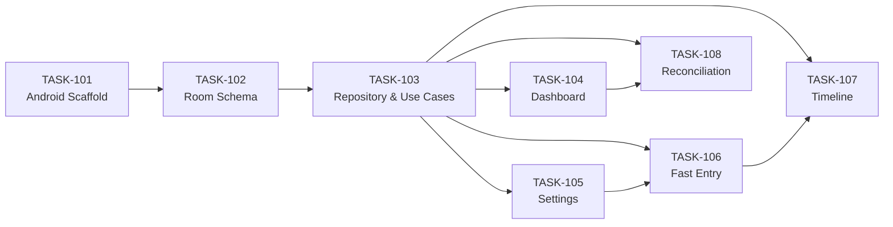

# Implementation Plan
## Family Finance App — MVP

---

## Dependency Graph

---

## Wave 1 — Foundation

### TASK-101 · Initialize Android Project Scaffold
> **Type:** Scaffold · **Verification:** `./gradlew assembleDebug`

Bootstrap a working Jetpack Compose app with Hilt DI, Compose Navigation, and clean architecture package structure.

**Steps:**
1. Create Android project with Compose template
2. Add deps to `build.gradle.kts`: Compose, Room, Hilt, Navigation, Coroutines
3. Set up `@HiltAndroidApp` application class
4. Create `NavHost` with 5 placeholder routes: Dashboard, Timeline, FastEntry, Settings, Reconcile
5. Create package skeleton: `ui/`, `domain/usecase/`, `data/local/`, `data/repository/`, `di/`
6. Create empty `DatabaseModule` and `RepositoryModule` Hilt modules
7. Update `AGENTS.md`: `BUILD_CMD=./gradlew assembleDebug`, `LINT_CMD=./gradlew lint`

**Definition of Done:**
- `./gradlew assembleDebug` passes with no errors
- Package structure matches VIEW-004
- NavHost with all 5 routes compiles

*Traces: FR-008 · VIEW-004 · ADR-002*

---

## Wave 2 — Data Layer

### TASK-102 · Room Database — Entities and DAOs
> **Type:** Feature · **Verification:** `./gradlew testDebugUnitTest` · **Depends on:** TASK-101

Define all 4 Room entities and DAOs. All 6 transaction types must be present in the enum. DAOs return `Flow<T>` for reactive queries.

**Steps:**
1. `AccountEntity`: `id` (UUID), `name`, `type` (BANK/CASH/CREDIT_CARD/INVESTMENT), `owner_label`, `created_at` — **no balance column** (ADR-003)
2. `CategoryEntity`: `id`, `name`, `icon`, `color`
3. `ProjectEntity`: `id`, `name`, `start_date`, `end_date`
4. `TransactionEntity`: all fields per DATA-001:
   - `id`, `account_id`, `category_id`, `project_id` (nullable)
   - `type`: `INCOME | EXPENSE | TRANSFER | OPENING_BALANCE | RECONCILIATION_ADJUSTMENT | REVALUATION`
   - `amount`, `date`, `created_at`, `owner_label`, `receiver`, `note`
   - `receipt_group_id` (nullable), `transfer_linked_id` (nullable)
   - `is_system_generated` (0/1, default 0)
5. Add indexes: `account_id`, `date DESC`, `receipt_group_id`, `project_id`
6. Create DAOs returning `Flow<T>` for all reads; `insertAll` with `@Transaction` on `TransactionDao`
7. Wire `AppDatabase` and `DatabaseModule` Hilt provider
8. Write DAO unit tests: insert / query / delete for each entity

**Definition of Done:**
- All 4 entities compile with Room annotation processing
- `TransactionEntity.type` enum has all 6 values
- No `balance` column on `AccountEntity`
- `./gradlew testDebugUnitTest` passes

*Traces: FR-001–004, FR-008, FR-009, FR-013 · DATA-001 · ADR-001, ADR-003, ADR-004*

---

### TASK-103 · FinanceRepository & Use Cases
> **Type:** Feature · **Verification:** `./gradlew testDebugUnitTest` · **Depends on:** TASK-102

Implement `FinanceRepository` wrapping all DAOs and the 5 domain use cases. Use cases are **pure Kotlin** — no Android imports.

**Use Cases:**

| Use Case | Key Logic |
|---|---|
| `GetAccountBalancesUseCase` | SUM credits − SUM debits per account, handling all 6 tx types (ADR-003) |
| `SaveTransactionUseCase` | Validate mandatory category + account; persist single row |
| `SaveSplitReceiptUseCase` | Validate sum ≤ total; generate `receipt_group_id` UUID; `insertAll` in `@Transaction` |
| `SaveTransferUseCase` | Validate distinct accounts; generate `transfer_linked_id` UUID; insert both legs in `@Transaction` |
| `ReconcileAccountUseCase` | Compute discrepancy; create `RECONCILIATION_ADJUSTMENT` or `REVALUATION` row |

**Steps:**
1. Create `FinanceRepository` `@Singleton` wrapping all 4 DAOs
2. Implement each use case in `domain/usecase/`
3. Wire `RepositoryModule` Hilt provider
4. Unit tests: split sum validation, balance direction logic for all 6 types

**Definition of Done:**
- All 5 use cases have zero Android imports
- `saveSplitReceipt` and `saveTransfer` use Room `@Transaction`
- `GetAccountBalancesUseCase` correctly handles all 6 transaction types
- `./gradlew testDebugUnitTest` passes

*Traces: FR-001–005, FR-008–012 · VIEW-001, VIEW-002 · ADR-002, ADR-003*

---

## Wave 3 — UI Screens

> TASK-104 and TASK-105 can be worked **in parallel** — both depend only on TASK-103.

### TASK-104 · Dashboard Screen
> **Type:** Feature · **Verification:** Hybrid · **Depends on:** TASK-103

Material 3 dashboard showing all accounts with reactive balances and total wealth.

**Steps:**
1. `DashboardViewModel`: collect `GetAccountBalancesUseCase` Flow → `UiState(accounts, totalWealth)`
2. `DashboardScreen`: Material 3 Card per account (name, type icon, balance) + total wealth header
3. Empty state: prompt to create first account
4. Wire to NavGraph; add Reconcile shortcut button on each card (links to TASK-108)
5. ViewModel unit test: total wealth sum, empty state

**Definition of Done:**
- Balances update reactively without manual refresh
- Total wealth = sum of all account balances
- Empty state visible when no accounts

*Traces: FR-005 · VIEW-001, VIEW-002, ADR-003 · SCN-005*

---

### TASK-105 · Settings — Accounts, Categories, Projects
> **Type:** Feature · **Verification:** Hybrid · **Depends on:** TASK-103

Settings hub with full CRUD for all three reference entity types.

**Steps:**
1. `SettingsScreen` hub → `AccountsManageScreen`, `CategoriesManageScreen`, `ProjectsManageScreen`
2. **Account create form**: name, type picker, owner_label, `opening_balance` (default 0)
   - If `opening_balance > 0` → auto-call `SaveTransactionUseCase` to create `OPENING_BALANCE` row (`is_system_generated=1`)
3. **Category create form**: name, icon, color
4. **Project create form**: name, start_date (optional), end_date (optional)
5. Edit and delete for all three types
6. ViewModel test: creating account with opening balance creates correct system transaction

**Definition of Done:**
- Full CRUD for all 3 types
- Non-zero opening balance creates `OPENING_BALANCE` transaction with `is_system_generated=1`
- New items appear immediately in entry form pickers

*Traces: FR-007 · VIEW-001, VIEW-004 · SCN-007, SCN-013*

---

### TASK-106 · Fast Entry Sheet
> **Type:** Feature · **Verification:** Hybrid · **Depends on:** TASK-103, TASK-105

Single-screen bottom sheet handling **all** transaction types: expense, income, transfer, split receipt.

**Steps:**
1. `FastEntryViewModel` StateFlow: `type`, `amount`, `account`, `category`, `date`, `note`, `project` (optional), `splitLines[]`
2. Real-time remainder = `totalAmount − Σ(splitLines.amounts)`
3. Build `FastEntrySheet` BottomSheet: type toggle, mandatory pickers (account, category), optional project picker, dynamic split-line list
4. **Save paths:**
   - Single tx → `SaveTransactionUseCase` (reject if no category/account)
   - Split → `SaveSplitReceiptUseCase` (reject if sum > total)
   - Transfer → second account picker → `SaveTransferUseCase` (reject if same account)
5. ViewModel unit tests: remainder calc, all 3 rejection scenarios

**Definition of Done:**
- Missing category/account → validation rejection
- Split sum > total → rejection
- Same source/destination transfer → rejection
- Remainder auto-calculates in real-time
- Saved rows appear in Timeline immediately

*Traces: FR-001–004, FR-009 · VIEW-001, VIEW-002 · SCN-001, SCN-003, SCN-004*

---

### TASK-107 · Transaction Timeline
> **Type:** Feature · **Verification:** Hybrid · **Depends on:** TASK-103, TASK-106

Scrollable, filterable timeline grouped by month with visual receipt grouping and special type labels.

**Steps:**
1. `TimelineViewModel`: collect all transactions, apply filters (`owner_label`, `category_id`, `project_id`), group by month
2. `TimelineScreen` `LazyColumn`: month-header separators, regular rows, split-receipt indented groups, transfer pair indicator
3. Filter bar: owner_label chip, category picker, project picker (all optional and combinable)
4. Distinct labels by type:
   - `RECONCILIATION_ADJUSTMENT` → `⚖ Reconciliation Adjustment`
   - `REVALUATION`(gain) → `📈 Revaluation · Gain`, (loss) → `📉 Revaluation · Loss`
   - `OPENING_BALANCE` → `Opening Balance` (system indicator)
5. ViewModel unit tests: month grouping, category filter, project filter

**Definition of Done:**
- Descending date order with month headers
- Split rows visually grouped
- All 3 filters work independently and in combination
- All 6 transaction types labeled distinctly

*Traces: FR-006, FR-009 · VIEW-001, VIEW-004 · SCN-006, SCN-009*

---

## Wave 4 — Reconciliation

### TASK-108 · Account Reconciliation Screen
> **Type:** Feature · **Verification:** Hybrid · **Depends on:** TASK-103, TASK-104

Reconciliation flow: compare recorded vs actual balance, create typed correction transaction.

**Steps:**
1. `ReconciliationViewModel`: fetch recorded balance via `GetAccountBalancesUseCase`; compute `discrepancy = actual − recorded`
2. `ReconciliationScreen`:
   - Show: account name, recorded balance, actual balance input, discrepancy (green=0 / red=negative / amber=positive)
   - Zero → show "Reconciled ✓" + timestamp; no transaction
   - Non-zero + **Bank/Cash/CreditCard** → "Create Correction" → `RECONCILIATION_ADJUSTMENT` (amount locked, optional note)
   - Non-zero + **Investment** → "Create Revaluation" → `REVALUATION` (gain/loss labeled)
3. Link Reconcile button from Dashboard account cards
4. ViewModel tests: discrepancy computation, correct transaction type routing by account type

**Definition of Done:**
- Zero discrepancy → confirmation only, no transaction
- Correction amount is locked to the discrepancy value
- `REVALUATION` only offered for `Investment` account type
- After correction, account balance equals entered actual value

*Traces: FR-010–012 · VIEW-001, VIEW-004, ADR-003 · SCN-010, SCN-011, SCN-012*

---

## Summary

| # | Task | Status | Wave |
|---|---|---|---|
| TASK-101 | Android Project Scaffold | ⬜ Pending | 1 – Foundation |
| TASK-102 | Room Entities & DAOs | ⬜ Pending | 2 – Data |
| TASK-103 | Repository & Use Cases | ⬜ Pending | 2 – Data |
| TASK-104 | Dashboard Screen | ⬜ Pending | 3 – UI |
| TASK-105 | Settings (Accounts, Categories, Projects) | ⬜ Pending | 3 – UI |
| TASK-106 | Fast Entry Sheet | ⬜ Pending | 3 – UI |
| TASK-107 | Transaction Timeline | ⬜ Pending | 3 – UI |
| TASK-108 | Account Reconciliation | ⬜ Pending | 4 – Reconciliation |

**Next actionable task:** → `loom next` → **TASK-101**
