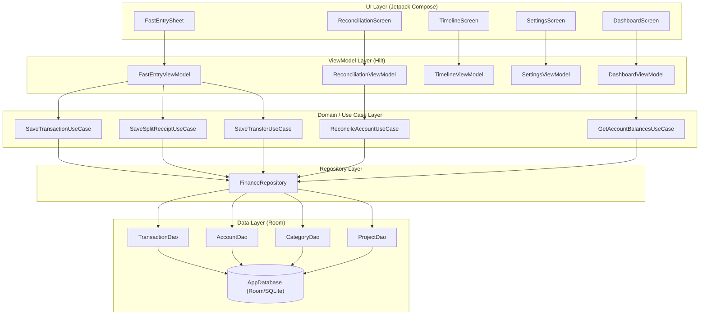
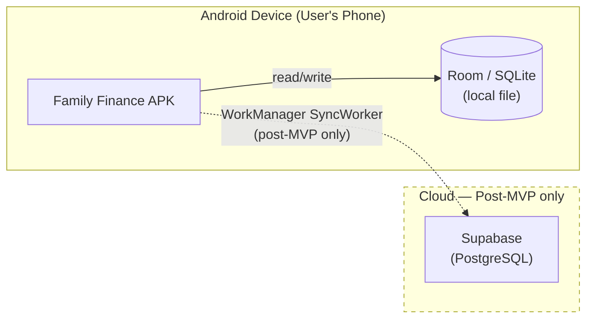

# Software Design Document (SDD)
## Family Finance App — MVP

---

## 1. Architecture Decisions

### ADR-001 — Local-First with Room (SQLite) ✅ Accepted

**Why:** The app must work fully offline (BR-003). Complex SQL aggregations (balance sums, group-by-category) are needed for reporting. A migration path to Supabase cloud sync is required post-MVP.

**Decision:** Room (ORM over SQLite) is the **sole data store for MVP**. Supabase sync added post-MVP via WorkManager without changing the Repository interface.

| Alternative | Rejected Because |
|---|---|
| Firestore | No GROUP BY/SUM → heavy client-side processing; unpredictable cost at scale |
| Supabase from day 1 | Requires auth + family group design before any feature can be built |

**Trade-offs:**
- ✅ Zero network dependency for MVP
- ✅ Room Flow → automatic reactive UI updates
- ✅ Repository pattern → swap storage layer without touching ViewModels
- ❌ Data on one device only until Supabase sync is built

---

### ADR-002 — Clean Architecture + Hilt DI + Jetpack Compose ✅ Accepted

**Decision:** `UI → Domain (UseCases) → Repository → Data (Room)` layering with Hilt for DI and Jetpack Compose for UI.

- **ViewModels** hold `StateFlow`-based UI state
- **Use Cases** are pure Kotlin — no Android framework dependencies → unit testable without emulator
- **Repository** abstracts storage — swap Room for Supabase without touching ViewModels or Use Cases

---

### ADR-003 — Computed Balances (No Stored Balance Column) ✅ Accepted

**Decision:** Account balance is **always computed** by aggregating `TransactionEntity` rows. There is **no `balance` column** on the `accounts` table.

`balance = SUM(credits) − SUM(debits)` via a Room `Flow<AccountWithBalance>` query.

| Alternative | Rejected Because |
|---|---|
| Stored balance column | Risk of corruption if write fails mid-update; editing past transactions requires manual recalculation |

**Trade-offs:**
- ✅ Single source of truth — always mathematically correct
- ✅ Editing/deleting transactions auto-updates balance
- ✅ Reconciliation compares one value vs actual — no cached field to sync
- ❌ O(n) query per account; acceptable at realistic household data sizes

---

### ADR-004 — Single-Currency MVP ✅ Accepted

**Decision:** No `currency_code` on any table for MVP. When multi-currency is added post-MVP, a Room schema migration adds `currency_code` columns.

**Trade-offs:**
- ✅ No currency picker, no exchange rate UI, simpler schema
- ❌ Future migration required (additive Column — straightforward in Room)

---

## 2. Architecture Views (4+1)

### VIEW-001 — Logical View



**Components:**

| Component | Type | Handles |
|---|---|---|
| `DashboardScreen` / `DashboardViewModel` | UI | Reactive account balances + total wealth |
| `FastEntrySheet` / `FastEntryViewModel` | UI | Expense, Income, Transfer, Split Receipt entry |
| `TimelineScreen` / `TimelineViewModel` | UI | Scrollable filtered transaction history |
| `SettingsScreen` / `SettingsViewModel` | UI | CRUD for Accounts, Categories, Projects |
| `ReconciliationScreen` / `ReconciliationViewModel` | UI | Balance verification + correction flow |
| `SaveTransactionUseCase` | Use Case | Validate + persist single transaction |
| `SaveSplitReceiptUseCase` | Use Case | Assign `receipt_group_id` + atomic multi-insert |
| `SaveTransferUseCase` | Use Case | Assign `transfer_linked_id` + atomic two-row insert |
| `ReconcileAccountUseCase` | Use Case | Compute discrepancy + create adjustment/revaluation |
| `GetAccountBalancesUseCase` | Use Case | Aggregate transaction sums per account |
| `FinanceRepository` | Repository | Single Hilt `@Singleton` wrapping all DAOs |
| `AppDatabase` | Database | Room `@Database` with all entity tables |

---

### VIEW-002 — Process View (Split Receipt Save Flow)

```mermaid
sequenceDiagram
  participant U as User
  participant VM as ViewModel
  participant UC as UseCase
  participant Repo as FinanceRepository
  participant DAO as Room DAO
  participant DB as SQLite

  Note over U,DB: Happy Path: Record Split Receipt
  U->>VM: enterAmount(100), addSplit(Food,80), addSplit(Consumables,20)
  VM->>VM: StateFlow updates remainder in real-time
  U->>VM: tapSave()
  VM->>UC: SaveSplitReceiptUseCase(lines, account)
  UC->>UC: validate(lines.sum <= total)
  UC->>UC: generate receipt_group_id = UUID.randomUUID()
  UC->>Repo: saveSplitReceipt(rows) [coroutine, IO dispatcher]
  Repo->>DAO: insertAll(rows) [Room @Transaction]
  DAO->>DB: BEGIN; INSERT x2; COMMIT
  DB-->>DAO: success
  UC-->>VM: Result.Success
  VM->>VM: emit UI state — sheet closes
  Note over DB,VM: Room emits Flow update automatically
  DB-->>DAO: new rows
  DAO-->>Repo: Flow<List<Transaction>>
  Repo-->>VM: Flow collected on Main dispatcher
  VM->>U: Timeline recomposes with new rows
```

**Key concurrency primitives:**

| Primitive | Role |
|---|---|
| `StateFlow` / `MutableStateFlow` | All UI state — Compose auto-recomposes on emission |
| `Dispatchers.IO` (coroutines) | All DAO suspend functions run off the main thread |
| Room `Flow<T>` | Read queries re-emit automatically on any write — drives reactive UI |
| Room `@Transaction` | `saveSplitReceipt()` and `saveTransfer()` atomic — both rows or neither |

---

### VIEW-003 — Physical View (Deployment)



- MVP runs entirely on the user's Android device
- SQLite file is private to the app sandbox
- Supabase sync added in Wave 4 (post-MVP) via `SyncWorker` without architecture changes

---

### VIEW-004 — Development View (Package Structure)

```
app/src/main/java/com/familyfinance/
│
├── ui/
│   ├── dashboard/       DashboardScreen, DashboardViewModel
│   ├── entry/           FastEntrySheet, FastEntryViewModel
│   ├── timeline/        TimelineScreen, TimelineViewModel
│   ├── settings/        SettingsScreen, AccountsManageScreen,
│   │                    CategoriesManageScreen, ProjectsManageScreen
│   ├── reconcile/       ReconciliationScreen, ReconciliationViewModel
│   └── navigation/      NavGraph, Routes
│
├── domain/
│   └── usecase/         SaveTransactionUseCase, SaveSplitReceiptUseCase,
│                        SaveTransferUseCase, ReconcileAccountUseCase,
│                        GetAccountBalancesUseCase
│
├── data/
│   ├── local/entity/    AccountEntity, TransactionEntity,
│   │                    CategoryEntity, ProjectEntity
│   ├── local/dao/       AccountDao, TransactionDao,
│   │                    CategoryDao, ProjectDao
│   ├── local/           AppDatabase
│   └── repository/      FinanceRepository
│
└── di/                  DatabaseModule, RepositoryModule
```

---

## 3. Data Model (Room / SQLite)

```dbml
Table accounts {
  id          TEXT  [pk]          // UUID
  name        TEXT  [not null]
  type        TEXT  [not null]    // BANK | CASH | CREDIT_CARD | INVESTMENT
  owner_label TEXT  [not null]    // "Serge", "Julia" — filtering only, not security
  created_at  INTEGER [not null]  // epoch millis

  Note: 'No balance column — always computed from transactions (ADR-003)'
}

Table categories {
  id    TEXT [pk]
  name  TEXT [not null]
  icon  TEXT                      // icon identifier string
  color TEXT                      // hex, e.g. #FF5733
}

Table projects {
  id         TEXT    [pk]
  name       TEXT    [not null]
  start_date INTEGER            // epoch millis, optional
  end_date   INTEGER            // epoch millis, optional
}

Table transactions {
  id                 TEXT    [pk]               // UUID
  account_id         TEXT    [not null, ref: > accounts.id]
  category_id        TEXT    [not null, ref: > categories.id]
  project_id         TEXT    [ref: > projects.id]  // nullable — optional tag
  type               TEXT    [not null]
  // INCOME | EXPENSE | TRANSFER | OPENING_BALANCE
  // RECONCILIATION_ADJUSTMENT | REVALUATION

  amount             REAL    [not null]         // always positive; direction from type
  date               INTEGER [not null]         // user-selected date, epoch millis
  created_at         INTEGER [not null]         // system record time, epoch millis
  owner_label        TEXT                       // mirrors account owner by default
  receiver           TEXT                       // payee / counterparty (optional)
  note               TEXT                       // free-text memo (optional)

  receipt_group_id   TEXT    // UUID — links split receipt rows (FR-003)
  transfer_linked_id TEXT    // UUID — links transfer debit+credit legs (FR-004)
  is_system_generated INTEGER [not null, default: 0]
  // 1 for OPENING_BALANCE rows — excluded from cash-flow reports
}
```

### Balance Computation

```
balance(account) =
  + SUM(amount) WHERE type IN (INCOME, OPENING_BALANCE, REVALUATION[gain],
                                TRANSFER[credit leg], RECONCILIATION_ADJUSTMENT[positive])
  − SUM(amount) WHERE type IN (EXPENSE, REVALUATION[loss],
                                TRANSFER[debit leg], RECONCILIATION_ADJUSTMENT[negative])
```

### Recommended Indexes

| Index | Purpose |
|---|---|
| `idx_tx_account_id` on `transactions(account_id)` | Balance queries |
| `idx_tx_date` on `transactions(date DESC)` | Timeline ordering |
| `idx_tx_receipt_group` on `transactions(receipt_group_id)` | Split receipt grouping |
| `idx_tx_project_id` on `transactions(project_id)` | Project filter |
