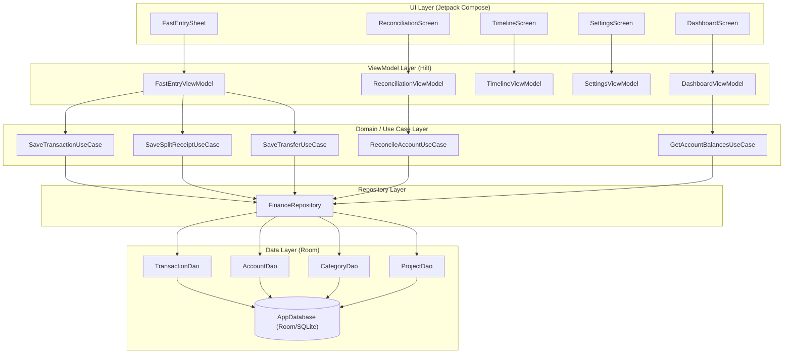
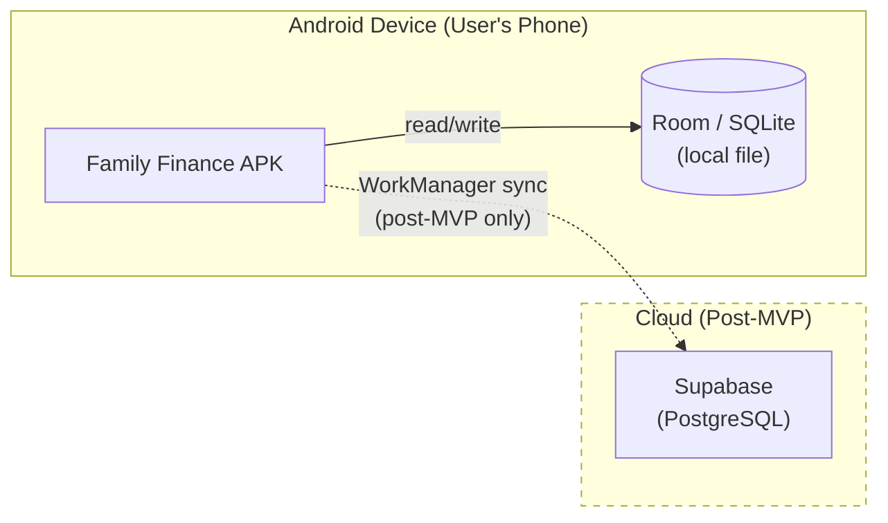
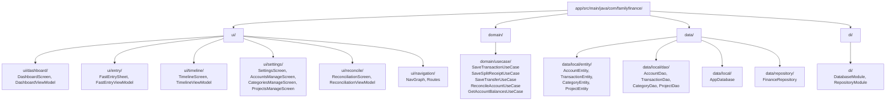

# Software Design Document (SDD)

## 1. Architecture Decisions (ADR)

### ADR-001: Local-First Architecture with Room (SQLite) for MVP
*   **Status:** Accepted
*   **Context:** The app must work fully offline (BR-003, FR-008). We need a database for the MVP that requires no network, is well-supported on Android, and allows complex aggregate queries for balance computation and reporting. The future requires a migration path to cloud sync.
*   **Decision:** Use Room (an ORM over SQLite) as the sole data store for the MVP. All reads and writes go directly to the local Room database. Supabase cloud sync is explicitly deferred to post-MVP (T8 in the plan) and will be added via a WorkManager-based SyncWorker without changing the Repository interface.
*   **Alternatives:**
    
    - **Firestore (Firebase):** NoSQL cloud-first database with offline caching.
    
    - **Supabase from Day 1:** Use Supabase as the primary store, with local caching.
    
*   **Consequences:**
    - Positive: Zero network dependency for MVP — works anywhere, any time, Room's Flow-based queries provide automatic reactive UI updates, SQL schema for complex balance/reporting queries without client-side aggregation, Repository pattern already abstracts storage — adding Supabase sync later requires no ViewModel/UseCase changes
    - Negative: Data lives only on one device until Supabase sync is built, Multi-device family sharing is not possible during MVP phase

### ADR-002: Clean Architecture with Hilt DI and Jetpack Compose UI
*   **Status:** Accepted
*   **Context:** We need a maintainable code structure that supports rapid development now and SaaS scaling later. Android has multiple architecture patterns (MVP, MVC, MVI, MVVM + Clean). We also need dependency injection for testability.
*   **Decision:** Use Clean Architecture layering (UI → Domain/UseCases → Repository → Data) with Hilt for dependency injection and Jetpack Compose for UI. ViewModels hold StateFlow-based UI state. Use Cases contain business logic and are pure Kotlin (no Android framework dependencies). The Repository abstracts the data layer.
*   **Alternatives:**
    
    - **MVVM without Use Cases:** ViewModels call the Repository directly, no separate domain layer.
    
*   **Consequences:**
    - Positive: Use Cases are pure Kotlin — unit tests need no Android emulator, Hilt provides compile-time DI validation — fewer runtime crashes, Repository interface means the data source can be swapped (Room → Supabase) without touching ViewModels or Use Cases, Compose + StateFlow gives a predictable unidirectional data flow
    - Negative: More files and layers to set up initially, Hilt requires understanding of annotation processing

### ADR-003: Balance Computed from Transactions (No Stored Balance Column)
*   **Status:** Accepted
*   **Context:** Account balances change every time a transaction is added, edited, or deleted. We need to decide whether to store a running balance on the Account row (cache) or compute it on-the-fly from transaction history.
*   **Decision:** Account balance is always computed by aggregating TransactionEntity rows (SUM by account_id and type direction). There is NO balance column on the accounts table. This is the single source of truth. Room DAOs will expose a Flow<AccountWithBalance> query that Room re-evaluates reactively on any transaction change.
*   **Alternatives:**
    
    - **Stored balance column on Account:** Maintain a running balance field on the Account row, updated atomically with each transaction write.
    
*   **Consequences:**
    - Positive: Single source of truth — balance is always mathematically correct relative to all recorded transactions, Editing or deleting transactions automatically updates balance via Room Flow re-evaluation, Reconciliation only needs to compare the computed balance vs actual — no separate balance field to keep in sync
    - Negative: Balance query is O(n) over all transactions for that account, At very large transaction counts (>10,000 per account), may need a snapshot/checkpoint strategy — acceptable risk for MVP

### ADR-004: Single-Currency MVP — No Currency Column on Transaction
*   **Status:** Accepted
*   **Context:** The brainstorm listed multi-currency support as in-scope. However, adding currency conversion requires an exchange rate source, complex UI, and significantly more data model complexity. BR-005 explicitly defers multi-currency to post-MVP.
*   **Decision:** For the MVP, the app operates in a single implicit default currency. There is NO currency field on the Transaction or Account tables. All amounts are stored as plain REAL values in the same implicit currency. When multi-currency is added post-MVP, a migration will add a currency_code column to both accounts and transactions, and a currencies table with exchange rates.
*   **Alternatives:**
    
    - **Add currency_code column now (even if unused):** Include currency fields in the schema from day one, defaulting to a single currency.
    
*   **Consequences:**
    - Positive: Simpler schema and UI for MVP — no currency picker, no exchange rate concerns, Faster to build MVP features, Multi-currency can be designed correctly once the core app is proven
    - Negative: A Room schema migration (adding currency_code columns) will be required when multi-currency is added, Existing data rows will need DEFAULT currency values during migration

### ADR-005: Centralized and Type-Safe Navigation
*   **Status:** Accepted
*   **Context:** As the application grows, managing routes as strings in MainActivity becomes error-prone and hard to maintain. We need a centralized way to define routes and handle navigation logic to ensure consistency across the app.
*   **Decision:** Use a centralized NavGraph component located in the `ui.navigation` package. Routes are defined using a `Screen` sealed class to ensure type safety. MainActivity acts solely as an entry point, delegating all navigation to the NavHost controller within NavGraph.
*   **Alternatives:**
    
    - **Hardcoded Navigation:** Keep all routes as strings in MainActivity.
    
*   **Consequences:**
    - Positive: Type safety for routes reduces runtime crashes, Better separation of concerns: MainActivity is clean, Centralized NavGraph makes it easy to visualize and manage app flow, Easier to implement deep linking in the future
    - Negative: Small amount of boilerplate for new routes


---

## 2. Architectural Views (4+1)

### VIEW-001: Logical View — Component Breakdown (Logical)
**Concerns:** Modularity, Separation of Concerns, Testability

**Elements:**

*   **DashboardScreen / DashboardViewModel** (UI Component): Displays all accounts with reactive balances and total wealth

*   **FastEntrySheet / FastEntryViewModel** (UI Component): Single-screen entry for Expense, Income, Transfer, and Split Receipt

*   **TimelineScreen / TimelineViewModel** (UI Component): Scrollable, filterable transaction history grouped by month

*   **SettingsScreen / SettingsViewModel** (UI Component): Hub for managing Accounts, Categories, and Projects

*   **ReconciliationScreen / ReconciliationViewModel** (UI Component): Balance verification and correction flow for all account types

*   **SaveTransactionUseCase** (Use Case): Validates and persists a single transaction via the Repository

*   **SaveSplitReceiptUseCase** (Use Case): Assigns a shared receipt_group_id and persists multiple transaction rows atomically

*   **SaveTransferUseCase** (Use Case): Creates two linked transfer rows with a shared transfer_linked_id atomically

*   **ReconcileAccountUseCase** (Use Case): Compares recorded vs actual balance and creates RECONCILIATION_ADJUSTMENT or REVALUATION transaction

*   **GetAccountBalancesUseCase** (Use Case): Aggregates transaction amounts per account to compute current balance

*   **FinanceRepository** (Repository): Single Hilt Singleton wrapping all DAOs. Abstracts storage from domain logic

*   **AppDatabase (Room)** (Database): Room SQLite database with all entity tables. Provides DAOs via @Database annotation


**Diagram Source:**


### VIEW-002: Process View — Data Flow and Concurrency (Process)
**Concerns:** Concurrency, Offline Safety, Reactive UI Updates, Atomic Writes

**Elements:**

*   **StateFlow (ViewModel)** (Concurrency Primitive): All UI state is held in StateFlow/MutableStateFlow. Compose collectors recompose automatically on emission.

*   **Kotlin Coroutines (IO Dispatcher)** (Concurrency Primitive): All DAO operations are suspend functions executed on Dispatchers.IO to avoid blocking the main thread.

*   **Room Flow** (Reactive Stream): DAOs return Flow<T> for all read queries. Any write triggers automatic re-emission to all collectors, driving reactive UI updates.

*   **Room @Transaction (atomic write)** (Atomicity Guarantee): saveSplitReceipt() and saveTransfer() are wrapped in a Room @Transaction to ensure both rows are committed together or not at all.


**Diagram Source:**
```mermaid
sequenceDiagram
  participant U as User
  participant VM as ViewModel
  participant UC as UseCase
  participant Repo as FinanceRepository
  participant DAO as Room DAO
  participant DB as SQLite

  Note over U,DB: Happy Path: Record Split Receipt
  U->>VM: enterAmount(100), addSplit(Food,80), addSplit(Consumables,20)
  VM->>VM: StateFlow updates remainder in real-time
  U->>VM: tapSave()
  VM->>UC: SaveSplitReceiptUseCase(lines, account)
  UC->>UC: validate(lines.sum <= total)
  UC->>UC: generate receipt_group_id = UUID.randomUUID()
  UC->>Repo: saveSplitReceipt(rows) [coroutine, IO dispatcher]
  Repo->>DAO: insertAll(rows) [Room atomic transaction]
  DAO->>DB: BEGIN; INSERT x2; COMMIT
  DB-->>DAO: success
  DAO-->>Repo: Unit
  Repo-->>UC: Unit
  UC-->>VM: Result.Success
  VM->>VM: emit UI state — sheet closes
  Note over DB,VM: Room emits Flow update
  DB-->>DAO: new rows
  DAO-->>Repo: Flow<List<Transaction>>
  Repo-->>VM: Flow collected on Main dispatcher
  VM->>U: Timeline recomposes with new rows
```

### VIEW-003: Physical View — Deployment Topology (Physical)
**Concerns:** Offline-First, Deployment Simplicity, Future Cloud Sync

**Elements:**

*   **Android Device** (Node): Single deployment target for MVP. Application runs entirely on the user's personal phone.

*   **Room/SQLite (local file)** (Storage): Primary and only data store for MVP. File is private to the app sandbox — no external access.

*   **Supabase (PostgreSQL)** (Cloud Service): Post-MVP cloud backend. WorkManager will push synced rows when connectivity is available. Not present in MVP build.


**Diagram Source:**


### VIEW-004: Development View — Package Structure (Development)
**Concerns:** Maintainability, Build Speed, Module Boundaries

**Elements:**

*   **ui/** (Package): All Compose screens, ViewModels, and navigation. One sub-package per screen/feature.

*   **domain/usecase/** (Package): Pure business logic use cases. No Android dependencies — easily unit tested.

*   **data/local/** (Package): Room entities, DAOs, and the AppDatabase configuration.

*   **data/repository/** (Package): FinanceRepository — the single interface between domain and data layers.

*   **di/** (Package): Hilt modules wiring the dependency graph.


**Diagram Source:**


### VIEW-005: Design System — Shared Components (Logical)
**Concerns:** Consistency, Reusability, UX

**Elements:**

*   **CurrencyInput** (UI Component): Shared composable for monetary input with decimal scaling and bold formatting

*   **IconPicker** (UI Component): Visual grid-based picker for category and account icons

*   **NormalizedInputStyle** (Design Guideline): Project-wide standard for OutlinedTextFields using MaterialTheme.shapes.large for a rounded, premium feel.


**Diagram Source:**
```mermaid

```


---

## 3. Data Models

### DATA-001: 


**Entities:**


---

## 4. API Contracts

